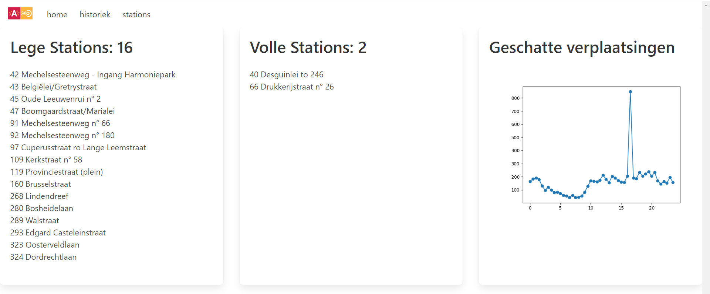

# Velo Website
Velo website leest data in van de database en zet een flask server op.
De data is verzameld door de code van labo 9 elke 30 min uit te voeren
in een chrontab. De bedoeling is dat 
beide processen samen zouden werken.

Er zijn een paar redenen waarom ik hier niet toe gekomen ben
- een server opzetten valt buiten de scope van de opgave
- ik ben ontevreden met de opbouw van mijn code. Het is erg omslachtig om de data in te lezen terwijl dit veel makkelijker
zou zijn met een json object.
- ik ben tegen een blok aangelopen met het gebruiken
van images in flask. Ze kunnen precies enkel vanuit een "static" folder
worden uitgelezen maar daar kon ik niet naar schrijven met de plot functie.

Aangezien de 2 opgaves niet samenwerken is dit wel niet actuele data! 

## Screenshot

